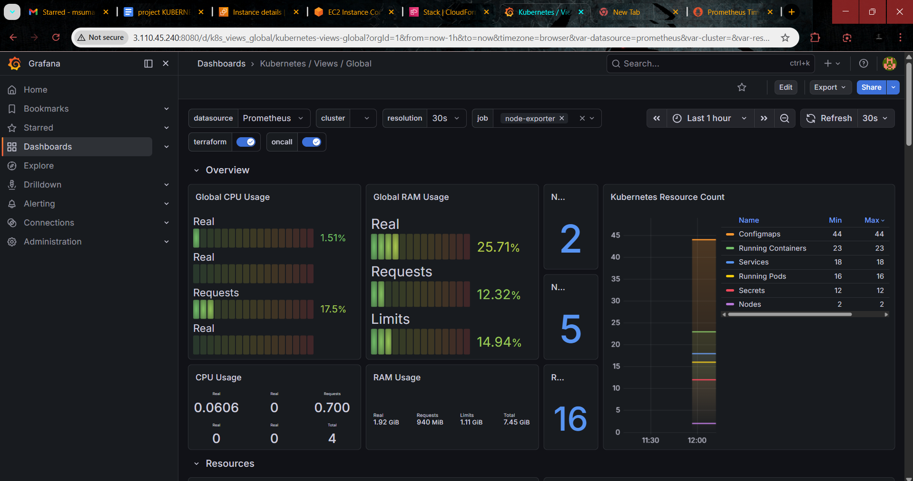
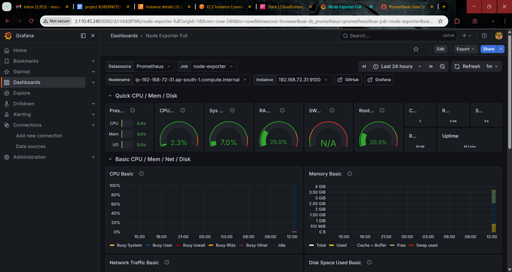

# Kubernetes Monitoring on AWS EKS  
### Prometheus + Grafana + Alertmanager

## Overview

This project demonstrates a complete monitoring setup on **Amazon EKS** using Prometheus, Grafana, and Alertmanager.

The infrastructure includes:

- EC2 Bastion Server with IAM Role
- Amazon EKS Cluster
- Managed Node Group
- Helm-based deployment of kube-prometheus-stack
- Grafana dashboards for cluster and node metrics

---

## Architecture Components

- AWS EC2
- AWS IAM
- Amazon EKS
- Kubernetes
- Helm
- Prometheus
- Grafana
- Alertmanager
- Node Exporter
- kube-state-metrics

---

## 📊 Monitoring Dashboards

### 1️⃣ Kubernetes Cluster Overview

Displays:

- Global CPU Usage
- Global RAM Usage
- Resource Count
- Running Pods
- Node Status

---

### 2️⃣ Node Exporter Metrics Dashboard

Displays:

- CPU Utilization
- Memory Usage
- Disk Usage
- Network Traffic
- System Uptime

---

## Deployment Summary

This project performs the following:

- Creates EC2 Bastion instance
- Attaches IAM role (AdministratorAccess)
- Installs AWS CLI, kubectl, eksctl, Helm
- Provisions EKS cluster
- Creates managed node group
- Deploys kube-prometheus-stack via Helm
- Configures port forwarding for Grafana, Prometheus, Alertmanager
- Imports production-grade Grafana dashboards

---

## Accessing Services

After deployment:

- Grafana → `http://<ec2-public-ip>:8080`
- Prometheus → `http://<ec2-public-ip>:9090`
- Alertmanager → `http://<ec2-public-ip>:9093`

---

## Skills Demonstrated

- Cloud Infrastructure Provisioning
- Kubernetes Cluster Management
- Observability & Monitoring
- Production-Style Monitoring Stack Deployment
- AWS & DevOps Tooling

## Author

Suman M
